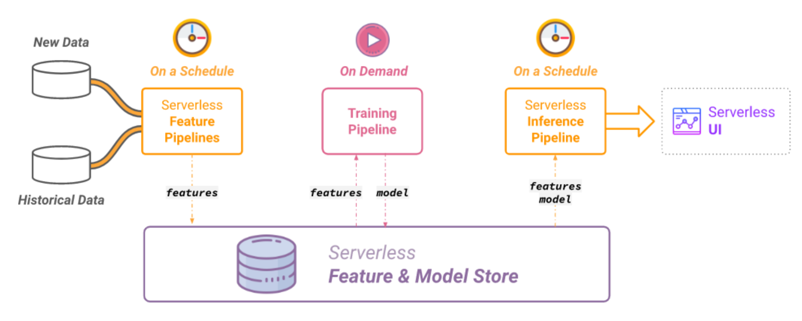
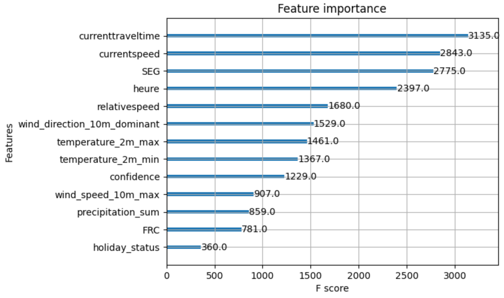
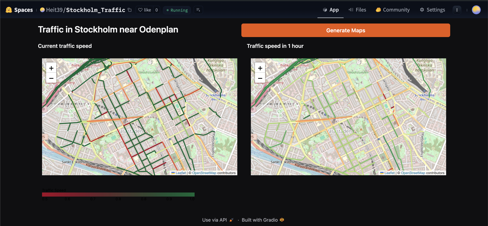

# Serverless Traffic Prediction Machine Learning System

## Overview  
This project leverages **Hopsworks** as the data management platform and **XGBoost** as the machine learning model to predict traffic conditions over each segment of a certain area. The target variable for prediction is the **relative speed**, defined as:  


The system is designed for a location in **Stockholm**, near Odenplan, with the following coordinates:  **59.34318, 18.05141**.  

The hugging face space with the UI is available [here](https://huggingface.co/spaces/Heit39/Stockholm_Traffic)

## Key Features  
- **Data Preprocessing**: Includes cleaning and preparing traffic data for efficient analysis.  
- **Serverless Machine Learning**: Implements serverless architecture to streamline deployment and scalability of ML workflows.  
- **Model Training**: Uses the XGBoost algorithm for robust and accurate predictions.  
- **Performance Optimization**: Fine-tuning the model with grid search to improve accuracy and reduce overfitting.  
- **Real-world Application**: Designed to provide actionable insights for traffic management and optimization with an UI

  

## File Organization  
The repository is structured as follows:  

```plaintext
Project-ID2223_TrafficApp/  
├── notebooks/  
│   ├── Startup.ipynb  # Jupyter notebook to create segment map, feature stores and introduce first data
│   ├── Update_hourly.ipynb     # Jupyter notebook to update features stores (called by a github action every hour)  
│   ├── Training.ipynb     # Jupyter notebook for model training to update model registry(called by a github action every week)
│   ├── Inference.ipynb     # Jupyter notebook for model inference (called by a github action every hour)
```


# Serverless Traffic Flow Prediction in Stockholm

**KTH Royal Institute of Technology**  
Mathis DESERT & Diogo R. da SILVA  

---

## Introduction

Efficient traffic management is a major challenge for modern cities, where the constant increase in traffic leads to problems such as congestion, pollution, and inefficiency in transportation systems. One of the solutions to address these issues is traffic condition prediction using machine learning techniques. By analyzing historical and real-time data, it is possible to develop models that anticipate traffic behavior and optimize traffic flow management.

In this report, we present a traffic prediction system based on machine learning, using Hopsworks as the data management platform and a gradient boosting algorithm for regression. The model is designed to estimate traffic conditions based on real-time data, and we aim to evaluate its effectiveness in predicting traffic behavior.

---

## Methodology

The development process of the prediction system was structured in several key steps:

### Data Collection and Management

The data used to train and test the model comes from three sources: TomTom for traffic conditions, OpenMeteo for meteorological data, and Calendarific for holidays and events. These APIs were accessed through HTTP requests. OpenMeteo provides a library for processing requests, while custom processing was developed for TomTom and Calendarific. Handling the TomTom API was particularly challenging, leading to some missing data for segments within the area of interest, although the map is mostly complete. Each entry in the final dataset is identified by three primary keys: the time when the data was collected, the road segment type (frc), and the coordinate description of the road segment.

Hopsworks was chosen as the data management platform for its efficient handling of large volumes of data and machine learning models, as well as its ease of use and accessibility.


### Data Preprocessing

The selected data sources were carefully vetted to ensure no outliers were present, so no additional cleaning was required. Since we used a gradient-based model, normalization was unnecessary as the data was already in a suitable range. Preprocessing focused on encoding categorical variables, such as road types and geographic coordinates, and resampling the dataset to achieve a more uniform distribution.

### Model Selection

We chose the XGBoost Regressor for traffic prediction due to its ability to handle non-linear relationships and its strong performance in regression tasks. Hyperparameter tuning was done using Grid Search to optimize parameters such as `n_estimators`, `max_depth`, `learning_rate`, and `subsample`, enhancing model accuracy and generalization. XGBoost's advantages include efficiency, overfitting prevention through regularization, and scalability for large datasets.

### Model Training

The data was split into training, validation, and testing sets with 60%, 20%, and 20% proportions, respectively. Resampling was applied to achieve a more uniform distribution of examples, as many samples represented fluid traffic conditions. The XGBoost model was trained using regression techniques to predict traffic conditions.

### Model Evaluation

The model's performance was evaluated using Mean Squared Error (MSE) and the R-squared coefficient (R²). These metrics assess the accuracy of the model's predictions and its ability to explain variance in the target variable.

---

### Pipelining

The ML model operates in a fully automated pipeline with new data continuously feeding feature stores for inference and training.  
- **Hourly Update:** Weather and traffic data are fetched by the `update_hourly` pipeline.  
- **Inference:** The inference pipeline retrieves the stored model from Hopsworks and predicts traffic conditions for the next hour.  
- **UI Updates:** Predicted values are stored in a feature store and displayed via the UI pipeline.  
- **Training:** Weekly training integrates new and historical data, monitors metric evolution, and updates the model as needed.



---

## Results

### Model Results

| Train MSE | Test MSE | R² Score |
|-----------|----------|----------|
| 0.02      | 0.02     | 0.38     |

The MSE metric indicates good performance on training and testing data. However, the R² score suggests the model struggles to capture underlying patterns effectively, likely due to limited data.



Key features influencing predictions include:
- **Hour**
- **Current Speed**
- **Travel Time**
- **Road Segment**

Weather-related features provided limited insight, likely due to insufficient data during impactful weather conditions, such as heavy snowfall.

---

### UI Results

The application developed contains two main windows displaying:  
1. **Current Traffic Conditions**  
2. **Predicted Traffic Conditions (Next Hour)**  

Traffic is measured by the relative speed metric, calculated as the current speed divided by free-flow speed on the same street.  
- **Red**: Low relative speed.  
- **Dark Green**: Relative speed close to 1.  

The application includes:
- A legend for color-coding.  
- A refresh button to update maps.  
- Fully interactive maps (predictions are available in a limited area).  



---

## Conclusion

The traffic prediction system demonstrates the potential of machine learning to forecast traffic conditions using real-time and historical data. While the MSE is satisfactory, the R² score highlights the need for improvement, likely due to limited data variability. Key features like hour, current speed, and road segment were highly predictive, but insufficient weather-impact samples hindered insights. Expanding the dataset, especially under certain conditions, could enhance the model's accuracy and reliability.
